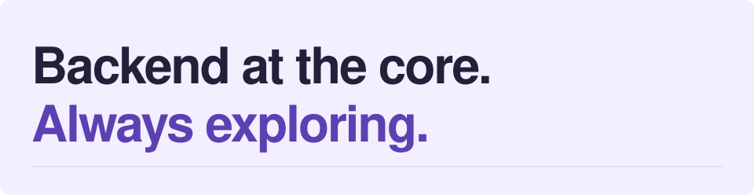
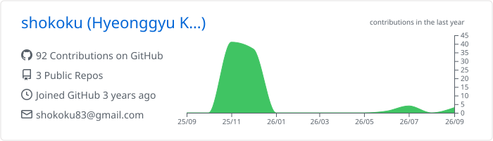
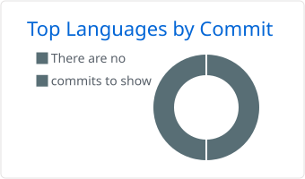

<picture>
  <source media="(prefers-color-scheme: dark)" srcset="./assets/profile-header-dark.svg" />
  
</picture>

# Hyeonggyu Kim

**Backend Developer · Java & Spring Boot**

Java와 Spring Boot를 주력으로 사용하는 백엔드 개발자입니다. 
새로운 기술은 직접 써보며 배우고, 요즘은 AI 에이전트가 개발 방식을 어떻게 바꾸는지 탐색합니다.

[GitHub](https://github.com/shokoku) · [Email](mailto:shokoku83@gmail.com)

## Engineering stack

  
  

| Layer | Technologies |
| :--- | :--- |
| Data & messaging | `PostgreSQL` · `Redis` · `Kafka` |
| Cloud & runtime | `Docker` · `Kubernetes` · `AWS` |

## AI & agents

**MCP를 통한 도구 연결과 에이전트 활용**에 관심이 있습니다. 아래 에이전트는 직접 사용해 보았습니다.

| Agent | Focus |
| :--- | :--- |
| [Hermes Agent](https://github.com/NousResearch/hermes-agent) | 메모리와 스킬을 갖춘 AI 에이전트 |
| [Grok Bot](https://docs.x.ai/grok-bot/overview) | 여러 도구에서 작업을 수행하는 AI 팀원 |
| [OpenClaw](https://github.com/openclaw/openclaw) | 직접 운영하는 개인용 AI 어시스턴트 |

## GitHub activity

  
활동 기록과 사용 언어 펼쳐보기

   
  <picture>
    <source media="(prefers-color-scheme: dark)" srcset="./profile-summary-card-output/github_dark/0-profile-details.svg" />
    
  </picture>
   
  <picture>
    <source media="(prefers-color-scheme: dark)" srcset="./profile-summary-card-output/github_dark/2-most-commit-language.svg" />
    
  </picture>
  
GitHub Actions로 자동 갱신되는 활동 기록입니다.

